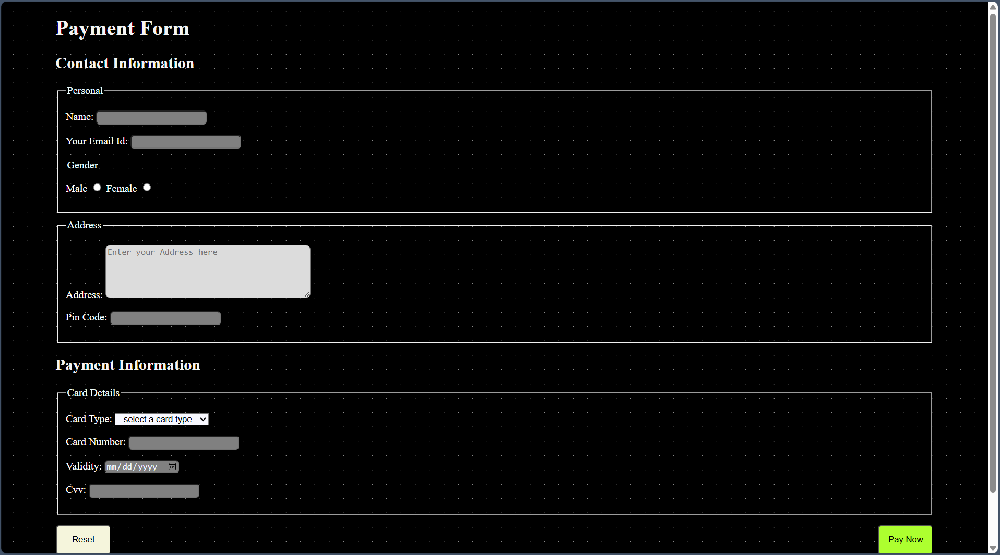

# Payment Form

## Overview
This is a simple and responsive **Payment Form** built using **HTML and CSS**. It collects user details such as **personal information, address, and payment details**, ensuring a smooth and user-friendly experience.

## Features
- **Responsive Design:** The form adapts to different screen sizes.
- **Field Validations:** Required fields prevent incomplete submissions.
- **Stylized Buttons:** "Reset" and "Pay Now" buttons are well-positioned and styled.
- **Modern Background:** A subtle gradient and dotted effect enhance aesthetics.
- **Improved Layout:** Aligned input fields for a structured look.

## Technologies Used
- **HTML5**
- **CSS3**

## Installation
1. Clone this repository:
   ```sh
   git clone https://github.com/yourusername/payment-form.git
   ```
2. Navigate to the project folder:
   ```sh
   cd payment-form
   ```
3. Open `index.html` in a web browser.

## File Structure
```
/payment-form
│── index.html      # Main payment form
│── styles.css      # Stylesheet for design and layout
│── README.md       # Project documentation
```

## Usage
1. Fill in your **personal details** (name, email, gender, address, etc.).
2. Enter **payment details** (card type, number, expiry, CVV).
3. Click **"Pay Now"** to submit or **"Reset"** to clear the form.

## Screenshots


## Improvements & Future Enhancements
- Add **JavaScript validation** for better error handling.
- Implement **real-time card number formatting**.
- Enhance **mobile responsiveness** with advanced CSS.

## Contributing
Feel free to contribute by submitting a pull request or reporting issues!

## License
This project is **open-source** and available under the **MIT License**.

